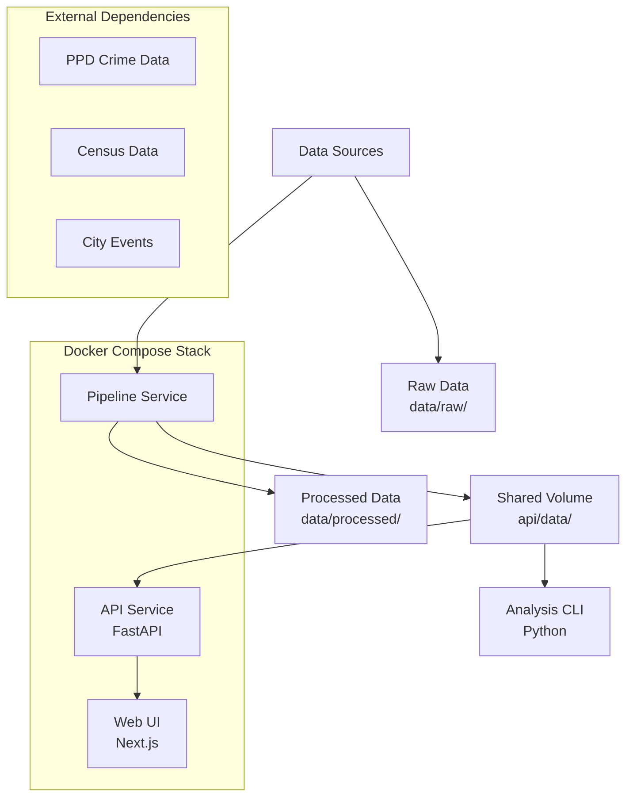

# Philadelphia Crime Incidents Analysis - System Architecture

## Overview

The Philadelphia Crime Incidents Analysis system is a comprehensive crime data analysis platform with three main architectural components: a data processing pipeline, a REST API service, and a web-based user interface. The system also includes a command-line analysis tool for advanced users and researchers.

## System Components

### 1. Data Pipeline (`pipeline/`)
- **Purpose**: Processes raw crime data from Philadelphia Police Department and Census sources
- **Technology**: Python with GeoPandas, Pandas, scikit-learn, Prophet
- **Output**: Pre-aggregated JSON and GeoJSON files stored in shared volume
- **Execution**: Runs as Docker service with periodic refresh capability

### 2. API Service (`api/`)
- **Purpose**: RESTful backend serving crime analysis data to web UI
- **Technology**: FastAPI with Uvicorn server
- **Features**: CORS-enabled, health checks, request logging, error handling
- **Data Loading**: Loads all analysis data at startup into memory cache

### 3. Web Interface (`web/`)
- **Purpose**: Interactive data visualization and exploration
- **Technology**: Next.js 15.5.2 with React 19
- **Features**: Mapbox integration, Recharts for data visualization, SWR for data fetching
- **Deployment**: Static export for Firebase Hosting

### 4. Analysis CLI (`analysis/`)
- **Purpose**: Advanced analysis commands for researchers and analysts
- **Technology**: Python with Typer CLI framework and Rich console output
- **Commands**: 13 analysis commands across 4 domains (chief, patrol, policy, forecasting)
- **Output**: Versioned reports with figures and markdown summaries

## Data Flow Architecture



### Data Processing Pipeline
1. **Ingestion**: Raw crime incidents from PPD, demographic data from Census
2. **Preprocessing**: Data cleaning, geocoding, temporal feature extraction
3. **Analysis**: Spatial analysis, temporal trends, forecasting models
4. **Export**: JSON/GeoJSON outputs for API consumption

### API Data Loading
- **Startup Process**: `load_all_data()` loads all JSON/GeoJSON files at FastAPI startup
- **Caching**: Data cached in module-level dictionaries for fast access
- **Health Check**: Validates required data files are present and loadable

## Service Interactions and Dependencies

### Docker Compose Orchestration
```yaml
services:
  pipeline:    # Data processing
    depends_on: []
    healthcheck: metadata.json exists
    
  api:         # REST API
    depends_on: 
      pipeline: {condition: service_healthy}
    healthcheck: /api/health endpoint
    
  web:         # Frontend
    depends_on:
      api: {condition: service_healthy}
    healthcheck: HTTP 200 on port 3000
```

### Shared Resources
- **Data Volume**: `shared_api_data` volume mounts to `/app/api/data/` in API container
- **Environment Variables**: Service configuration via `.env` file
- **Health Checks**: HTTP-based health validation with retries and timeouts

### API Endpoints Structure
```
/api/health              # Service health and data status
/api/v1/trends/*         # Temporal trend analysis
/api/v1/spatial/*        # Geographic/spatial analysis  
/api/v1/policy/*         # Policy evaluation data
/api/v1/forecasting/*    # Prediction and forecasting
/api/v1/questions/*      # Q&A feature with Firestore
/api/v1/metadata/*       # Data metadata and schemas
```

## Deployment Architecture

### Local Development
- **Orchestration**: Docker Compose with hot-reload for development
- **Service Ports**: API (8080), Web (3001)
- **Volume Mounting**: Source code mounted for live updates
- **Resource Limits**: CPU/memory limits configurable via environment

### Production Deployment
- **API Service**: Google Cloud Run (serverless container execution)
- **Web Interface**: Firebase Hosting (CDN-backed static hosting)
- **Data Pipeline**: Runs on schedule in Cloud Run or Cloud Functions
- **Secrets Management**: Google Cloud Secret Manager for credentials

### Infrastructure Components
- **Container Registry**: Google Container Registry for Docker images
- **CI/CD**: Cloud Build for automated deployment
- **Monitoring**: Cloud Logging, Cloud Monitoring for observability
- **Security**: IAM roles, VPC networking, CORS policies

## Scalability and Performance Considerations

### API Service
- **Data Caching**: All analysis data loaded into memory at startup
- **Request Logging**: Structured logging with request IDs and timing
- **Error Handling**: Comprehensive exception handlers with appropriate HTTP status codes
- **Health Checks**: Fast validation of data availability and service health

### Resource Management
- **CPU Limits**: Configurable via `*_CPU_LIMIT` environment variables
- **Memory Limits**: Configurable via `*_MEM_LIMIT` environment variables  
- **Health Check Tuning**: Interval, timeout, and retry configuration
- **Startup Periods**: Grace periods for service initialization

### Performance Optimizations
- **Data Pre-aggregation**: Pipeline pre-computes expensive analyses
- **Efficient Formats**: JSON/GeoJSON for fast API serialization
- **Lazy Loading**: Optional lazy loading for large datasets (future)
- **Caching Strategy**: Browser caching for static assets, API response caching

### Monitoring and Observability
- **Health Endpoints**: `/api/health` provides data loading status
- **Request Metrics**: Response times, error rates, request volumes
- **Log Aggregation**: Structured logging for debugging and monitoring
- **Dependency Checks**: Validates data pipeline completion before API startup

## Security Considerations

### API Security
- **CORS Configuration**: Configurable allowed origins for web UI
- **Input Validation**: Pydantic models for request/response validation
- **Error Handling**: Sanitized error messages prevent information leakage
- **Authentication**: Admin endpoints protected with JWT tokens

### Data Privacy
- **PII Handling**: Raw data with PII stored in `data/raw/` (gitignored)
- **Cleaned Data**: Processed data has PII removed before analysis
- **Access Controls**: API endpoints serve aggregated, anonymized data only

### Container Security
- **Non-root Users**: Services run as non-privileged users
- **Minimal Images**: Python slim images reduce attack surface
- **Secret Management**: Sensitive config via environment variables and Secret Manager</content>
<parameter name="filePath">/Users/dustinober/Projects/Philadelphia-Crime-Incidents-Analysis/.planning/codebase/ARCHITECTURE.md